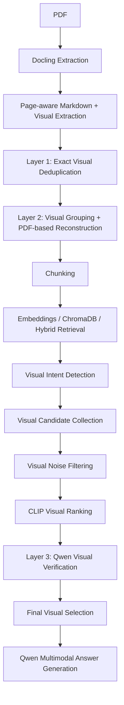

# MARIS

## Overview

MARIS is a multimodal Retrieval-Augmented Generation (RAG) system for technical PDF documents. Built with FastAPI, MARIS accepts uploaded PDFs, extracts text and visual elements while preserving page-level information, creates searchable chunks, and intelligently retrieves text and visual context. It automatically detects when a user's question requires visual information, retrieves and ranks visual candidates, verifies them, and sends the relevant text and selected images to a multimodal Qwen model (via Groq) to generate accurate answers with source traceability.

## Current Architecture Flow

Information flows through the MARIS system as follows:



## The Three Visual Layers

MARIS processes and filters visuals through three distinct layers to ensure only the most relevant and high-quality images are sent to the LLM.

### Layer 1 — Visual Deduplication
- Detects exact duplicate image bytes using an MD5 hash.
- Avoids saving duplicate physical image files.
- Preserves where duplicates occurred using occurrence metadata instead of storing duplicates.
- Keeps complete page and bounding-box traceability.

### Layer 2 — Visual Grouping & Reconstruction
- Resolves issues where Docling might extract parts of a larger diagram as fragmented, separate visual elements.
- MARIS intelligently groups spatially related elements on the same page using proximity rules (BFS).
- It calculates a union bounding box for the grouped elements.
- It directly renders the corresponding region from the original PDF using `pypdfium2`, producing a reconstructed visual region.
- Preserves source metadata and traceability for the newly grouped image.
- *Note:* Grouping is intentionally conservative to prevent accidentally grouping the entire page.

### Layer 3 — Verified Visual Ranking
- **CLIP** (`openai/clip-vit-base-patch32`) provides the initial visual ranking, computing the similarity between the user's question and both the image embeddings and caption embeddings.
- A small number of top candidates are then verified using the existing multimodal Qwen infrastructure.
- Verification checks whether the candidate is genuinely relevant to the question, rejecting unrelated or purely decorative visuals.
- If verification fails or is inconclusive, the system safely falls back to the original CLIP ranking.
- Only the final selected visual is securely sent to the final Qwen answer-generation step.

## Text RAG

When a document is uploaded, MARIS performs the following text processing flow:
1. **Extraction:** PDF is converted to page-aware markdown via Docling.
2. **Chunking:** A `RecursiveChunker` breaks text down into tokens (using paragraphs, sentences, and spaces as separators) while maintaining chunk overlap.
3. **Embeddings & Indexing:** `BAAI/bge-small-en-v1.5` creates text embeddings, which are stored alongside their primitive metadata in **ChromaDB**.
4. **Retrieval:** When a query arrives, `HybridRetriever` combines Vector Semantic Search (ChromaDB) with Lexical Search (`BM25Okapi`) to rank chunks.
5. **LLM Execution:** The `ContextBuilder` formats the retrieved chunks, adding source and page number context, before passing it to Qwen for answer generation.

## Visual RAG: Text-only vs. Visual Questions

MARIS intelligently determines if an image needs to be included in the context:

- **Text-only question:** Visual processing is bypassed entirely, and zero images are sent to Qwen. This saves token budget and improves response time.
- **Visual question:** If visual intent is detected (e.g., "explain the diagram" or "architecture of the system"), MARIS:
  - Retrieves relevant text/pages.
  - Collects visual candidates directly attached to retrieved chunks or relevant pages.
  - Filters small visual noise (like tiny logos).
  - Ranks candidates using CLIP.
  - Verifies the top candidates via Layer 3.
  - Sends the selected image(s) alongside the retrieved text to Qwen.

## How It Works (Example Scenario)

**User asks:** *"What are the main layers shown in the technical architecture diagram?"*

1. **Detection:** MARIS identifies "technical architecture diagram" as a visual intent.
2. **Text Retrieval:** Relevant document/page content matching "technical architecture" is retrieved.
3. **Candidate Collection:** Visual candidates on those retrieved pages are collected.
4. **Ranking:** CLIP ranks the collected visuals against the question.
5. **Verification (Layer 3):** Qwen verifies if the top-ranked visual actually contains architectural layers.
6. **Selection:** The most relevant, verified visual is selected.
7. **Prompting:** The retrieved text and the selected visual are combined and sent to Qwen.
8. **Generation:** Qwen generates the final, accurate answer.

## Project Structure

```text
MARIS/
├── ai/
│   ├── extraction/
│   │   └── docling_extractor.py      # PDF parsing, Markdown/Picture extraction, Layers 1 & 2
│   ├── llm/
│   │   ├── llm_service.py            # Interfaces with Groq/Qwen for generation
│   │   └── prompt_builder.py         # Constructs the system prompts
│   └── rag/
│       ├── chunk_storage.py          # Saves/loads chunk data locally
│       ├── chunker.py                # Recursive text chunking logic
│       ├── context_builder.py        # Formats text context blocks
│       ├── embeddings_service.py     # Generates text embeddings (BAAI/bge-small-en-v1.5)
│       ├── retriever.py              # Hybrid retrieval (BM25 + ChromaDB Vector search)
│       ├── vector_store.py           # ChromaDB client management
│       └── visual_rag.py             # CLIP-based candidate ranking
├── backend/
│   ├── main.py                       # FastAPI application entry point
│   └── routes/
│       ├── chat.py                   # Chat endpoint, intent detection, visual candidate handling
│       └── upload.py                 # Document upload endpoint, triggers ingestion pipeline
├── frontend/                         # Vite/React frontend (currently default starter)
├── storage/                          # Local storage for extracted docs, images, and chromadb
├── tests/
│   ├── test_full_rag.py
│   ├── test_image_retrieval_fix.py
│   ├── test_layer1_deduplication.py
│   ├── test_layer2_grouping.py
│   └── test_layer3_verification.py
├── .env.example
├── README.md
└── requirements.txt
```

## Important Components

- `ai/extraction/docling_extractor.py`: Handles raw PDF processing via Docling. Implements **Layer 1** (MD5 visual deduplication) and **Layer 2** (BFS-based spatial visual grouping and `pypdfium2` image reconstruction).
- `ai/rag/chunker.py`: Splits markdown into recursive sized chunks, preserving tokens and characters.
- `ai/rag/embeddings_service.py`: Leverages HuggingFace's `BAAI/bge-small-en-v1.5` to embed text chunks.
- `ai/rag/vector_store.py`: Manages the local `ChromaDB` collection, handling storage, metadata serialization, and vector search.
- `ai/rag/retriever.py`: Implements a `HybridRetriever` joining ChromaDB's vector scores and `rank_bm25`'s lexical scores.
- `ai/rag/visual_rag.py`: Uses `openai/clip-vit-base-patch32` to rank visuals against queries using both image and caption similarities.
- `ai/rag/context_builder.py`: Formats retrieved RAG chunks nicely for the LLM to process.
- `ai/llm/llm_service.py`: Constructs multimodal payloads (base64 images + text) to interface with the Groq Qwen (`qwen/qwen3.8-27b`) model.
- `backend/routes/upload.py`: The `/upload` endpoint triggering document intake, extraction, chunking, embedding, and storage.
- `backend/routes/chat.py`: The `/chat` endpoint responsible for visual intent detection, text retrieval, fetching visual candidates, and orchestrating Layer 3 logic.

## Setup / Running Instructions

**1. Create and activate a virtual environment**
```bash
python -m venv .venv
source .venv/bin/activate  # On Windows: .venv\Scripts\activate
```

**2. Install dependencies**
```bash
pip install -r requirements.txt
```

**3. Configure Environment Variables**
Copy `.env.example` to `.env` and fill in your Groq API key:
```bash
GROQ_API_KEY=your_groq_api_key_here
```

**4. Start the backend**
```bash
uvicorn backend.main:app --reload
```
The API will be available at `http://127.0.0.1:8000`.

## API Overview

### `POST /upload`
- **Purpose:** Ingests a new PDF document into the system.
- **Input:** Multipart form data containing the `file` (PDF).
- **Output:** Returns JSON with ingestion status, a unique `document_id`, the total pages processed, chunks and embeddings created, and the total visual elements extracted.

### `POST /chat`
- **Purpose:** Answers user questions based on ingested documents.
- **Input:** JSON payload with `question` (string) and an optional `document_id` (string). If `document_id` is omitted, searches all documents.
- **Output:** Returns JSON containing the `answer` (string) generated by the LLM, alongside debug/traceability data like `images_used` and relevant context.

## Testing

Run the isolated test suite using the `unittest` framework:

```bash
python -m unittest tests/test_layer1_deduplication.py tests/test_layer2_grouping.py tests/test_layer3_verification.py
```
*Note: Layer 1, Layer 2, and Layer 3 tests currently pass successfully together.*

### Known Environment Limitations in Tests
Tests like `test_image_retrieval_fix.py` and `test_full_rag.py` have pre-existing environmental dependencies. For instance, `test_full_rag.py` expects specific pre-extracted markdown files (`storage/extracted_docs/CC_test.md`) to exist locally. Without these files, the tests will fail. Ensure your local environment has the required static files if you wish to run full RAG test scripts.

## Known Limitations / Current Status

**Currently Implemented:**
- PDF extraction
- Page-aware text retrieval
- Visual intent detection
- Exact visual deduplication (Layer 1)
- Visual grouping/reconstruction (Layer 2)
- CLIP ranking
- Multimodal verification (Layer 3)
- Multimodal Qwen answering
- Source/page tracking

**Known Limitations (Ongoing Improvements):**
- **Process Flow Visual Retrieval:** During testing with realistic PDFs (e.g., SIH.pdf), it was observed that while architectural diagrams reconstruct and match perfectly, queries concerning process-flows can sometimes lead to unrelated visuals being selected (despite the text answer remaining correct). Visual candidate ranking for complex process diagrams remains an ongoing area of refinement.
- **Large Diagram Safeguards:** The Layer 2 visual grouping intentionally aborts reconstruction if a group occupies >80% of a page area to avoid pulling in entire text pages. This may inadvertently skip some massive legitimate full-page diagrams.

## Future Work
- Improve visual grouping precision for complex process-flow diagrams.
- Refine visual candidate selection and CLIP similarity thresholds.
- Develop the Streamlit (or Vite/React) frontend for a seamless UI experience.
- Broader evaluation and stress-testing on diverse technical PDFs.