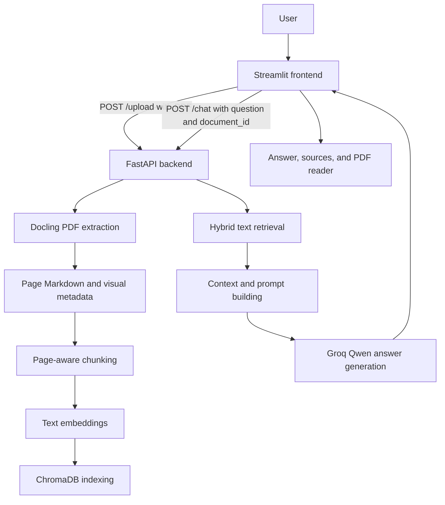
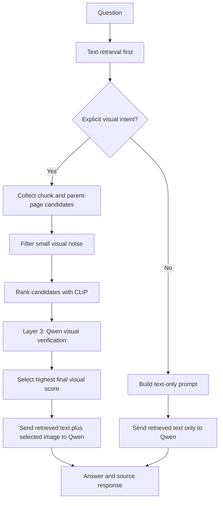

# MARIS

MARIS is a multimodal Retrieval-Augmented Generation (RAG) system for asking questions about technical PDF documents. RAG means that the system first retrieves relevant material from a document and then gives that material to a language model to produce an answer. Multimodal means that the system can use both extracted text and document images.

The current application has a Streamlit user interface and a FastAPI backend. A user uploads a PDF, waits for it to be indexed, and asks questions about that document. Text questions use retrieved text only. Questions that explicitly ask about a diagram, figure, chart, table, architecture, workflow, or similar visual can also retrieve and send a selected document image to Qwen.

## Features

- PDF extraction with Docling, including page-aware Markdown and picture metadata.
- Recursive page-level text chunking with source page and document metadata.
- Text embeddings from `BAAI/bge-small-en-v1.5`.
- Persistent ChromaDB storage and hybrid retrieval using vector similarity plus BM25 lexical scoring.
- Visual intent detection based on explicit phrases and visual object/action keywords.
- Visual candidate collection from retrieved chunks and relevant pages.
- Conservative visual-noise filtering, CLIP ranking, and Qwen verification.
- Exact visual deduplication, spatial visual grouping, and PDF-region reconstruction.
- Grounded answers with filename, page, and retrieval score source information.
- Streamlit PDF reader, chat history, source-page selector, and embedded PDF viewing.

## Architecture And Workflow

The backend has two registered routes: `POST /upload` indexes a PDF, and `POST /chat` retrieves context and generates an answer. The root route `GET /` is a simple server health response. The `session.py` and `highlight.py` files exist in `backend/routes`, but they are not included by `backend/main.py` and therefore do not expose routes in the running application.

### End-to-end flow



Upload processing saves each document under `storage/documents/<document_id>/`, writes Markdown and manifests, embeds the chunks, and upserts them into the persistent `storage/chroma_db` collection named `pdf_chunks`.

### Visual-question flow



### Visual processing layers

The extraction layers run during upload. The question-time visual stages run only after text retrieval and only when the question passes `requires_explicit_vision`.

1. **Visual intent detection.** The chat route checks direct phrases such as `explain the diagram`, architecture/workflow terms, and combinations of visual-object and action keywords.
2. **Visual candidate collection.** Candidates come from image metadata attached to retrieved chunks. The route can also load images from `pages.json` for the most relevant parent page. If no candidates are available, it falls back to the document visual manifest.
3. **Noise filtering.** Candidates large enough to be diagrams or figures are preferred over small icons or logos. If no large candidates exist, candidates are retained.
4. **CLIP ranking.** `openai/clip-vit-base-patch32` scores the supplied candidates against the question. Captions, when available, contribute to the visual score.
5. **Layer 1 - exact visual deduplication.** During Docling extraction, PNG bytes are hashed with MD5. Duplicate images reuse the canonical image path and keep page and bounding-box occurrence metadata.
6. **Layer 2 - spatial grouping and reconstruction.** On each page, nearby visual elements are grouped with a breadth-first search. The union bounding box is rendered from the original PDF with `pypdfium2`, creating a `reconstructed_group` image. Groups covering more than 80 percent of a page are skipped.
7. **Layer 3 - multimodal verification.** Each CLIP-ranked candidate is sent to the same Qwen service with a strict JSON relevance prompt. Relevant candidates receive a boost, irrelevant candidates receive a penalty, and verification failures fall back to the CLIP score. The highest final score is selected.
8. **Multimodal answer generation.** The selected image is base64 encoded and sent with the retrieved text to Qwen through Groq.

Text-only questions still perform text retrieval and context construction, but bypass candidate collection, CLIP ranking, verification, and image transmission. The final Qwen request contains retrieved text only. Visual questions use both retrieved text and one final selected image when a usable candidate exists.

## Streamlit Frontend

- `frontend/app.py` owns the page, Streamlit session state, PDF validation, upload lifecycle, chat submission, answer display, source display, and PDF reader layout.
- `frontend/api/client.py` provides `MarisClient`, which calls `POST /upload` and `POST /chat`, parses JSON, and reports backend/network errors.
- `frontend/components/chat_panel.py` renders the sidebar question form, chat history, and clear-chat action.
- `frontend/components/source_panel.py` renders filename, page, and relevance score information and lets the user select a source page.
- `frontend/components/pdf_viewer.py` displays the uploaded PDF with Streamlit's native PDF component when available, or an embedded base64 PDF iframe when a source page is selected or the native component is unavailable.
- `frontend/utils/config.py` reads the optional `MARIS_BACKEND_URL`, defaulting to `http://127.0.0.1:8000`.

The user selects one PDF in the uploader. The frontend rejects files that do not have a `.pdf` suffix or `%PDF` header, sends valid files to the backend, stores the returned `document_id`, and enables the question form only after successful indexing. Answers and source records are displayed beside the PDF reader; selecting a source page changes the PDF view to that page.

## Repository Structure

```text
MARIS/
├── ai/
│   ├── extraction/docling_extractor.py  # Page Markdown, pictures, Layers 1 and 2
│   ├── llm/
│   │   ├── llm_service.py               # Groq client and Qwen generation
│   │   ├── prompt_builder.py             # Text and image-aware prompts
│   │   └── question_service.py          # LLM package module
│   └── rag/
│       ├── chunker.py                    # Recursive text chunking
│       ├── chunk_storage.py              # JSON chunk persistence
│       ├── context_builder.py            # Retrieved context formatting
│       ├── embeddings_service.py         # BGE text embeddings
│       ├── retriever.py                  # ChromaDB plus BM25 retrieval
│       ├── vector_store.py               # Persistent ChromaDB collection
│       └── visual_rag.py                 # CLIP visual scoring and cache
├── backend/
│   ├── main.py                           # FastAPI app and registered routes
│   ├── config.py                         # Currently empty configuration module
│   ├── routes/
│   │   ├── chat.py                       # Query, visual intent, sources
│   │   ├── upload.py                      # PDF ingestion and indexing
│   │   ├── highlight.py                  # Present but not registered
│   │   └── session.py                    # Present but not registered
│   └── schemas/                          # Present schema modules; currently empty
├── frontend/
│   ├── app.py                            # Streamlit application entry point
│   ├── api/client.py                      # FastAPI HTTP client
│   ├── components/                       # Chat, PDF, and source UI
│   └── utils/config.py                   # Backend URL configuration
├── storage/
│   ├── documents/                        # Uploaded PDFs and generated artifacts
│   └── chroma_db/                        # Persistent ChromaDB data
├── tests/                                # Unit and integration-style tests
├── .env.example                          # Groq key template
├── requirements.txt                      # Python dependencies
└── README.md
```

Generated document artifacts include `document.md`, `pages.json`, `chunks.json`, `visual_manifest.json`, optional `visual_embeddings.json`, and an `images/` directory. These are created under each uploaded document directory and are intentionally omitted from the tree above.

## Technology Stack

- Python, FastAPI, Uvicorn, and Streamlit
- Docling and `pypdfium2` for PDF and visual extraction
- PyTorch, Transformers, and Hugging Face models
- `BAAI/bge-small-en-v1.5` for text embeddings
- `openai/clip-vit-base-patch32` for visual ranking
- ChromaDB for persistent vector storage
- `rank-bm25` for lexical retrieval
- Groq API with `qwen/qwen3.8-27b` for final text or multimodal answers

## Setup And Configuration

### Clone

```powershell
git clone https://github.com/Ayman4786/Updated-MARIS.git
cd Updated-MARIS
```

### Create an environment

Windows PowerShell:

```powershell
python -m venv .venv
.\.venv\Scripts\Activate.ps1
```

Linux or macOS:

```bash
python3 -m venv .venv
source .venv/bin/activate
```

Install the dependencies from the repository's pinned dependency file:

```bash
python -m pip install -r requirements.txt
```

### Configure API keys

Copy `.env.example` to `.env` and replace the placeholder with a Groq API key. Do not commit the real key.

PowerShell:

```powershell
Copy-Item .env.example .env
```

The backend reads:

```text
GROQ_API_KEY=your_groq_api_key_here
```

The frontend optionally reads `MARIS_BACKEND_URL`. If it is not set, it uses `http://127.0.0.1:8000`.

## Running The Application

Run the backend and frontend in separate terminals from the repository root, with the virtual environment activated in each terminal.

Terminal 1 - FastAPI:

```bash
uvicorn backend.main:app --reload
```

The backend listens at `http://127.0.0.1:8000`. Its health response is available at `GET /`.

Terminal 2 - Streamlit:

```bash
streamlit run frontend/app.py
```

Streamlit prints the local application URL, normally `http://localhost:8501`. Open that URL, upload a PDF, wait for processing to finish, and ask questions in the sidebar.

The first indexing or visual-ranking request may download or initialize the configured Docling, embedding, or CLIP model files, so processing time and memory use depend on the document and local environment.

## API Reference

### `GET /`

Returns:

```json
{"message": "Server Running"}
```

### `POST /upload`

Accepts a multipart form upload with a required field named `file`. The field should contain a PDF. The route creates a generated document ID, extracts the document, writes its artifacts, creates embeddings, and stores chunks in ChromaDB.

Successful responses include:

```json
{
  "filename": "document.pdf",
  "document_id": "document_<random-id>",
  "status": "success",
  "pages": 1,
  "chunks_created": 1,
  "embeddings_created": 1,
  "images_created": 0,
  "visual_elements": 0,
  "document_folder": "storage/documents/...",
  "chunks_file": "storage/documents/.../chunks.json",
  "preview": "..."
}
```

The numeric values and preview depend on the uploaded PDF.

### `POST /chat`

Accepts JSON with a required `question` string and an optional `document_id` string:

```json
{
  "question": "What is the main purpose of this system?",
  "document_id": "document_<random-id>"
}
```

When `document_id` is omitted, the route searches all uploaded document directories. The normal response contains:

```json
{
  "question": "...",
  "document_id": "...",
  "answer": "...",
  "sources": [
    {
      "document_id": "...",
      "filename": "document.pdf",
      "page": 1,
      "score": 0.8
    }
  ],
  "images_used": []
}
```

For a visual question, `images_used` contains the selected image path when a candidate is selected. If no documents exist, or the requested document is missing, the route returns an explanatory answer with empty `sources` and `images_used` lists.

## Testing And Current Status

The focused visual-layer suite is run with:

```bash
python -m unittest tests/test_layer1_deduplication.py tests/test_layer2_grouping.py tests/test_layer3_verification.py
```

In the current checkout, these Layer 1, Layer 2, and Layer 3 tests pass together. They cover MD5 deduplication and occurrence metadata, spatial grouping and PDF-region reconstruction, and Layer 3 selection and fallback behavior.

The broader test set can be attempted with:

```bash
python -m unittest discover -s tests -p "test*.py"
```

In the current checkout, discovery ran 10 tests and reported 4 errors. The errors include a missing legacy output directory for `test_chunk_storage.py`, missing `torch` and `fastapi` packages in the active interpreter, and the legacy full-RAG fixture path `storage/extracted_docs/CC_test.md`. Check the test output in the environment where they are run rather than treating this broader suite as proof of end-to-end accuracy.

The tested SIH.pdf example successfully reconstructed architecture diagrams and answered architecture-related visual questions. A process-flow question has also previously selected an unrelated visual even when its text-based answer was correct. Visual retrieval is therefore implemented and tested in focused areas, but it is not perfect or universally accurate.

## Current Limitations

- Visual intent is keyword and phrase based; a visual question that does not match the implemented patterns can follow the text-only path.
- Process-flow visual selection can still choose an unrelated image.
- Layer 2 intentionally skips groups covering more than 80 percent of a page, which can omit some legitimate full-page diagrams.
- The running application stores uploaded documents and ChromaDB data locally; there is no cleanup or multi-user lifecycle in the current code.
- The frontend displays source metadata returned by the backend, but source scoring is retrieval metadata rather than a guarantee that every cited chunk fully supports the answer.

## Future Improvements

- Improve visual intent detection beyond fixed phrases and keywords.
- Improve process-flow candidate ranking and evaluate it on more technical PDFs.
- Refine grouping thresholds and safeguards for large diagrams.
- Add broader, current end-to-end fixtures and isolate legacy tests from the active storage layout.
- Register or remove unused route modules and fill the currently empty schema/configuration modules as the API evolves.
